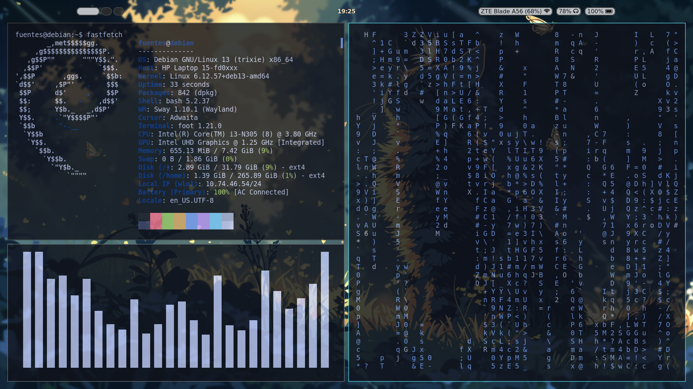

# Gjithsen's Sway Debian Rice 🍚

My first ever rice! Minimal, clean SwayWM setup on Debian.

  
*(Replace the line above with your actual screenshots — see below)*

## Preview

(Here are some placeholder previews until you add yours — these are similar minimal Sway rices for inspiration)

<grok-card data-id="130f0d" data-type="image_card"></grok-card>


<grok-card data-id="e6d364" data-type="image_card"></grok-card>


<grok-card data-id="61be3d" data-type="image_card"></grok-card>


## Key Components
- **WM**: Sway
- **Bar**: Waybar (custom style.css)
- **Launcher**: Wofi (custom style)
- **Terminal**: Foot
- **System Info**: Fastfetch
- **Wallpapers**: 3 custom ones included

## Installation (on fresh Debian)

```bash
git clone https://github.com/gjithsen/gjithsensswaydebianrice.git
cd gjithsensswaydebianrice
chmod +x install.sh
./install.sh